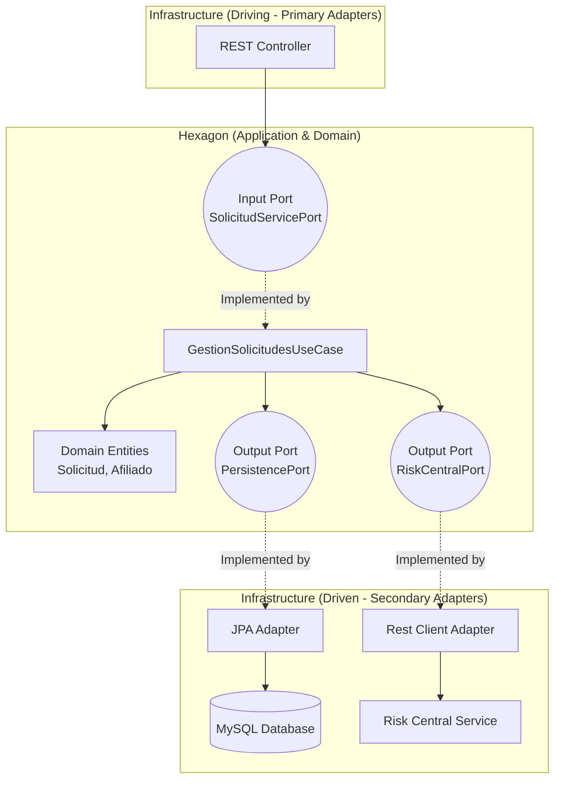
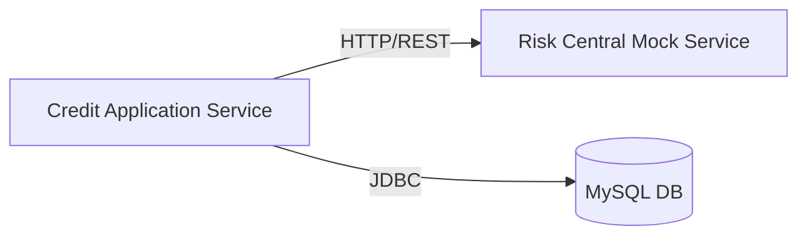

# CoopCredit - Credit Management System

This project implements a robust credit management system for a cooperative, designed under the principles of **Hexagonal Architecture (Ports and Adapters)** and **Microservices**.

## 📋 System Description

CoopCredit allows for the comprehensive management of the credit application lifecycle. The system is decoupled into independent components to ensure scalability, maintainability, and testability.

### Main Components:
1.  **Credit Application Service**: The core domain. Handles business logic, affiliate registration, and application processing.
2.  **Risk Central Mock Service**: Simulates an external credit bureau to assess applicant risk.
3.  **Database**: MySQL 8.0 for transactional persistence.

---

## 🏗 Hexagonal Architecture

The system strictly follows Hexagonal Architecture to isolate the domain from the infrastructure.



### Microservices Diagram



---

## 👥 Roles and Workflow

The system is designed to be used by credit analysts or automated systems.

### Roles
*   **User/Analyst**: Responsible for registering affiliates and managing credit applications.

### Main Workflow
1.  **Authentication**: The user registers (`/signup`) and logs in (`/signin`) to obtain a JWT token.
2.  **Affiliate Registration**: A client/affiliate is registered in the system with their basic data.
3.  **Credit Application**: An application associated with the affiliate is created.
4.  **Risk Evaluation**: The system automatically queries the risk service (Mock) to obtain a score.
5.  **Decision**: Based on the risk response and internal policies (maximum amount, history), the application is **Approved** or **Rejected**.

---

## 🔌 Endpoints

Complete interactive documentation is available in Swagger UI:  
👉 `http://localhost:8080/swagger-ui/index.html`

### 🔐 Authentication
| Method | Endpoint | Description |
|--------|----------|-------------|
| `POST` | `/api/auth/signup` | Register a new user in the system. |
| `POST` | `/api/auth/signin` | Log in and obtain JWT token. |

### 👤 Affiliates
| Method | Endpoint | Description |
|--------|----------|-------------|
| `POST` | `/api/v1/afiliados` | Register a new affiliate. Requires Auth. |

### 💳 Credit Applications
| Method | Endpoint | Description |
|--------|----------|-------------|
| `POST` | `/api/v1/solicitudes` | Create and process an application. Requires Auth. |

---

## 🚀 Execution Instructions

### Prerequisites
*   **Docker** and **Docker Compose** (Recommended)
*   Java 11+ and Maven (Only for manual execution)

### 🐳 Execution with Docker Compose (Recommended)

This option spins up the entire environment: Database, Credit Service, and Risk Mock.

1.  Clone the repository.
2.  From the project root, run:

```bash
docker compose up --build
```

3.  Wait for the services to start. The main service will be available at:
    *   URL: `http://localhost:8080`
    *   Swagger: `http://localhost:8080/swagger-ui/index.html`

### 💻 Local Execution (Manual)

If you prefer to run the main service on your machine:

1.  **Database**: Ensure MySQL is running on port 3306 (or adjust `application.properties`).
2.  **Mock Service**: Start the mock service or adjust the URL in the configuration if you are not going to use it.
3.  **Run**:

```bash
cd credit-application-service
mvn spring-boot:run
```

---

## 📸 Testing Screenshots

*(Below are examples of system usage)*

### 1. Successful User Registration

### 2. Login and Token Retrieval

### 3. Approved Application Creation


---

## 📊 Metrics and Logs Evidence

The system implements **Spring Boot Actuator** for monitoring and observability.

### Monitoring Endpoints
*   **Health Check**: `http://localhost:8080/actuator/health` - Health status of the service and dependencies (DB).
*   **Prometheus Metrics**: `http://localhost:8080/actuator/prometheus` - Metrics for scraping.

### Application Logs Example
The system records key events for traceability:

```text
INFO 1 --- [nio-8080-exec-1] c.c.c.a.a.in.web.SolicitudController   : Application received for affiliate ID: 12345
INFO 1 --- [nio-8080-exec-1] c.c.c.d.u.GestionSolicitudesUseCase    : Evaluating risk with external service...
INFO 1 --- [nio-8080-exec-1] c.c.c.i.o.adapter.risk.RiskAdapter     : Risk Response: SCORE=850, LEVEL=LOW
INFO 1 --- [nio-8080-exec-1] c.c.c.d.u.GestionSolicitudesUseCase    : Application APPROVED. Persisting in database.
```
