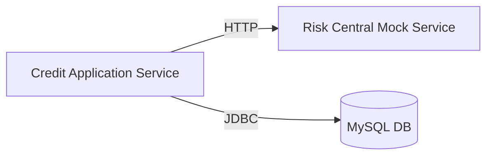

# CoopCredit - Credit Management System

This project implements a credit management system for a cooperative using Hexagonal Architecture and Microservices.

## Architecture

The system consists of the following components:

1.  **credit-application-service**: Main Microservice (Domain-Driven Design, Hexagonal).
    *   **Domain**: Pure business logic (Solicitud, Afiliado, EvaluacionRiesgo).
    *   **Ports**: Interfaces for external interaction (In/Out).
    *   **Adapters**: Port implementations (Web Controller, JPA Repository, Rest Client).
2.  **risk-central-mock-service**: Mock of an external risk central.
3.  **Database**: MySQL 8.0.

### Hexagonal Architecture Diagram

```mermaid
graph TD
    Client[Client] -->|HTTP POST| Controller[Web Controller (Adapter)]
    
    subgraph "Core Domain"
        Controller -->|Input Port| UseCase[GestionSolicitudesUseCase]
        UseCase -->|Output Port| RepoPort[Persistence Port]
        UseCase -->|Output Port| RiskPort[Risk Central Port]
    end
    
    subgraph "Infrastructure"
        RepoPort -->|Implements| RepoAdapter[Persistence Adapter]
        RiskPort -->|Implements| RiskAdapter[Risk Adapter]
        RepoAdapter -->|JPA| DB[(MySQL Database)]
        RiskAdapter -->|REST| RiskService[Risk Central Service]
    end
```

### Microservices Diagram



## Technologies

*   Java 11
*   Spring Boot 2.7
*   Spring Security (JWT)
*   Spring Data JPA
*   Flyway (DB Migrations)
*   MapStruct
*   Lombok
*   Docker & Docker Compose
*   Actuator & Micrometer (Observability)

## Execution

### Requirements
*   Java 11+
*   Maven
*   Docker & Docker Compose

### Run with Docker Compose (Recommended)

To start the entire environment (Database, Mock, and Service):

```bash
docker-compose up --build
```

The service will be available at: `http://localhost:8080`

### Run Locally

1.  Start MySQL database (or use the one from docker-compose).
2.  Configure `application.properties` if necessary.
3.  Run:

```bash
cd credit-application-service
mvn spring-boot:run
```

## Main Endpoints

*   **Swagger UI**: `http://localhost:8080/swagger-ui/index.html`
*   **Actuator**: `http://localhost:8080/actuator`
*   **Auth**:
    *   `POST /api/auth/signup`: Register user.
    *   `POST /api/auth/signin`: Login (Get JWT).
*   **Affiliates**:
    *   `POST /api/v1/afiliados`: Register affiliate.
*   **Applications**:
    *   `POST /api/v1/solicitudes`: Create credit application.

## Observability

*   Prometheus Metrics: `http://localhost:8080/actuator/prometheus`
*   Health: `http://localhost:8080/actuator/health`

## Testing

Run unit and integration tests:

```bash
mvn test
```
(Note: Integration tests require a Docker environment available for Testcontainers).